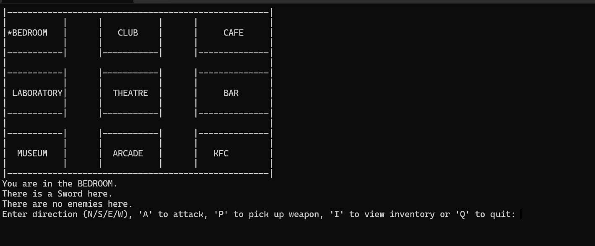

# Text-Based Adventure Game

## Overview

This project is a text-based adventure game created in Fall 2023 as part of a collaborative project for CPSC-2720 Practical Software Development . The game features a character navigating through different rooms, collecting weapons, and fighting enemies.

## Game Features

- **Rooms**: Nine rooms (Bedroom, Club, Cafe, Laboratory, Theatre, Bar, Museum, Arcade, KFC) connected in a specific layout.
- **Weapons**: Various weapons placed in specific rooms to aid the character in combat.
- **Enemies**: Enemies placed in specific rooms that the character must fight to survive.
- **Map Display**: Visual representation of the room layout with the character's current position.
- **Combat System**: Basic combat mechanics where the character can attack enemies and check their health.
- **Inventory Management**: Ability to pick up and view weapons in the character's inventory.

## Gameplay

1. **Navigation**: Move between rooms using 'N' (North), 'S' (South), 'E' (East), and 'W' (West) commands.
2. **Combat**: Attack enemies in the current room using the 'A' command.
3. **Pick Up Weapons**: Pick up available weapons in the current room using the 'P' command.
4. **Inventory**: View the character's inventory using the 'I' command.
5. **Quit**: Exit the game using the 'Q' command.

## How to Run
- g++ -o adventure_game main.cpp Character.cpp Room.cpp Weapon.cpp Enemy.cpp
- ./adventure_game
## Image 

